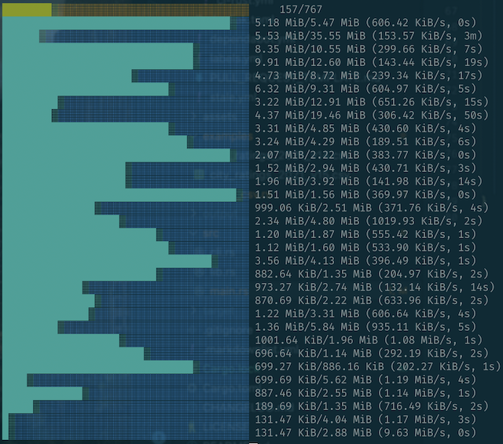

# Trauma

Tokio Rust Asynchronous Universal download MAnager

## Description

`Trauma is a library simplifying and prettifying HTTP(s) downloads. The
downloads are executed asynchronously and progress bars are drawn on the screen
to help monitoring the process.



### Features

- Library only
- HTTP(S) downloads
- Download files via providing a list of URLs
  - Ability to rename downloaded files
- Ability to configure the download manager
  - Download directory
  - Maximum simultaneous requests
  - Number of retries
- Asynchronous w/ [Tokio]
- Progress bar w/ [indicatif]
  - Display the individual progress
  - Display the total progress

## Usage

Add this to your `Cargo.toml`:

```toml
[dependencies]
trauma = "1.0"
```

## Quickstart

```rust
use std::path::PathBuf;
use trauma::{download::Download, downloader::DownloaderBuilder, Error};

#[tokio::main]
async fn main() -> Result<(), Error> {
    let reqwest_rs = "https://github.com/seanmonstar/reqwest/archive/refs/tags/v0.11.9.zip";
    let downloads = vec![Download::try_from(reqwest_rs).unwrap()];
    let downloader = DownloaderBuilder::new()
        .directory(PathBuf::from("output"))
        .build();
    downloader.download(&downloads).await;
    Ok(())
}
```

More examples can be found in the [examples](examples) folder.

## Why another download manager

Before starting this project, I spent some time searching the internet, trying
not to reinvent the wheel. And I did find a bunch of interesting exisiting
projects!

However they are almost all abandonned:

- DLM: <https://github.com/agourlay/dlm>
  - Active, but is just a binary/CLI tool
- Snatch: <https://github.com/derniercri/snatch>
  - Inactive since Sept '17
  - Recommend switching to [Zou]
- Zou: <https://github.com/k0pernicus/zou>
  - Inactive since Oct '17
- Duma: <https://github.com/mattgathu/duma>
  - Inactive since Nov '20
- Siwi: <https://github.com/rs-videos/siwi-download>
  - Inactive since Mar '21
- Downloader: <https://github.com/hunger/downloader>
  - Dying project
  - No answers to issues/PRs
  - Only automated updates are being merged
  - No release since Feb '21

As a result, I decided to write `trauma`.

### Potential ideas for future versions

- Resume download
- Optional progress bar
- Support for other download protocol (i.e.: FTP)

[indicatif]: https://github.com/console-rs/indicatif
[tokio]: https://tokio.rs/
[zou]: https://github.com/k0pernicus/zou
