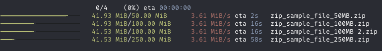

# Trauma

[](https://crates.io/crates/trauma)
[](https://docs.rs/trauma/)
[](https://github.com/rgreinho/trauma/actions/workflows/ci-rust.yml)

Tokio Rust Asynchronous Universal download MAnager

## Description

Trauma is a library simplifying and prettifying HTTP(s) downloads. The downloads
are executed asynchronously and progress bars are drawn on the screen to help
monitoring the process.



### Features

- Library only
- HTTP(S) downloads with [rustls]
- Support download via proxies
- Download files via providing a list of URLs
  - Automatically use the remote file names
  - Ability to rename downloaded files
- Ability to configure the download manager
  - Download directory
  - Maximum simultaneous requests
  - Number of retries
  - Resume downloads (if supported by the remote server)
  - Custom HTTP Headers
- Asynchronous w/ [Tokio]
- Progress bar w/ [indicatif]
  - Display the individual progress
  - Display the total progress
- Ability to customize the progress bars
  - Customize the format
  - Customize the progression style
  - Leave them on the screen or clear them upon completion
  - Hide any or both of them
  - Use pre-configured styles

## Usage

Add this to your `Cargo.toml`:

```toml
[dependencies]
trauma = "3"
```

### Features

By default, `trauma` enables [rustls] for TLS support.

To explicitly use the legacy `default-tls` specify this feature instead:

```toml
[dependencies]
trauma = { version = "3", default-features = false, features = ["default-tls"] }
```

## Quick start

```rust
use trauma::{download::Download, downloader::DownloaderBuilder, Error};

#[tokio::main]
async fn main() -> Result<(), Error> {
    let reqwest_rs = "https://github.com/seanmonstar/reqwest/archive/refs/tags/v0.11.9.zip";
    let downloads = vec![Download::builder().url(reqwest_rs)?.build()];
    let downloader = Downloader::builder().directory("output").build();
    downloader.download(&downloads).await;
    Ok(())
}
```

More examples can be found in the [examples](examples) folder. They are well
commented and will guide you through the different features of this library.

## Why another download manager

Before starting this project, I spent some time searching the internet, trying
not to reinvent the wheel. And I did find a bunch of interesting existing
projects!

However they are almost all abandoned:

- DLM: <https://github.com/agourlay/dlm>
  - Active, but is just a binary/CLI tool
- Snatch: <https://github.com/derniercri/snatch>
  - Inactive since Sept '17
  - Recommend switching to [Zou]
- Zou: <https://github.com/k0pernicus/zou>
  - Inactive since Oct '17
- Duma: <https://github.com/mattgathu/duma>
  - Inactive since Nov '20
- Siwi: <https://github.com/rs-videos/siwi-download>
  - Inactive since Mar '21
- Downloader: <https://github.com/hunger/downloader>
  - Dying project
  - No answers to issues/PRs
  - Only automated updates are being merged
  - No release since Feb '21

As a result, I decided to write `trauma`.

[indicatif]: https://github.com/console-rs/indicatif
[rustls]: https://rustls.dev/
[tokio]: https://tokio.rs/
[zou]: https://github.com/k0pernicus/zou
